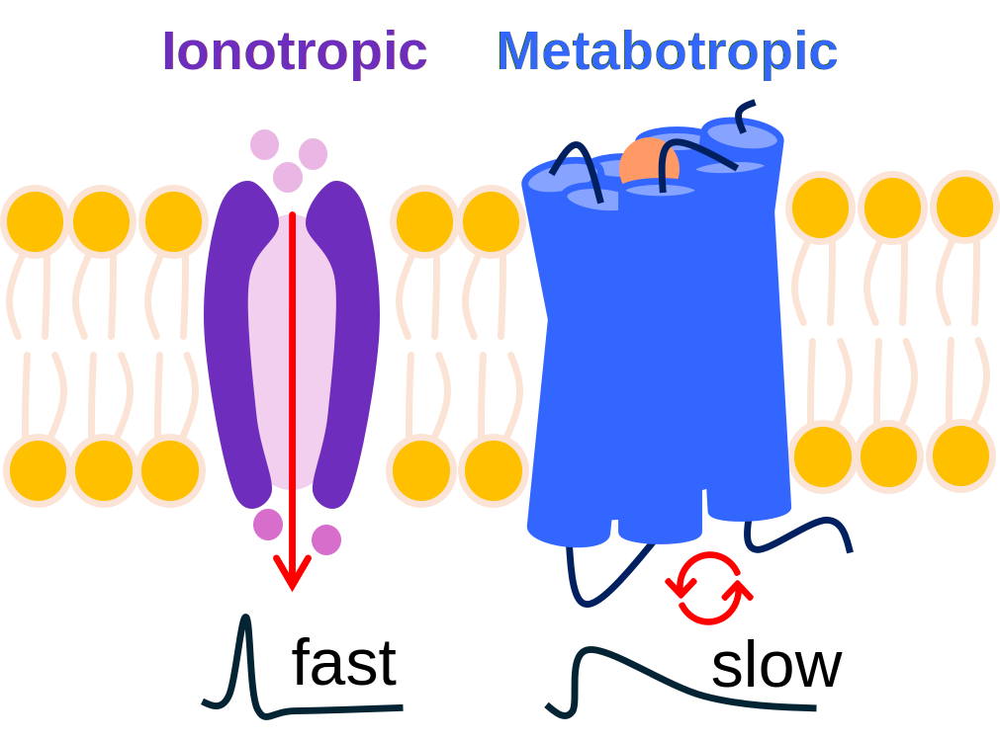

### Neural Circuits Group (NCG) — Newcastle University

This tutorial is part of the teaching activities of the **Neural Circuits Group (NCG)** at
**Newcastle University**, which studies how neuronal diversity and neuromodulation shape
computation in biological and neuromorphic circuits.

These tutorials are designed and developed by the NCG team:

- Srikanth Ramaswamy (<Srikanth.Ramaswamy@newcastle.ac.uk>) (Principal Investigator)
- Anindya Ghosh (<Anindya.Ghosh@newcastle.ac.uk>)
- Alejandro Rodriguez-Garcia (<A.Rodriguez-Garcia2@newcastle.ac.uk>)


## 2026 CNEW TUTORIALS

This tutorial accompanies our perspective on bringing neurobiological first principles —
neuronal diversity and cell-specific neuromodulation — into spiking neural networks and
neuromorphic systems ([Rodriguez-Garcia, Ghosh, Mei & Ramaswamy, 2025](https://arxiv.org/abs/2407.04525)).


## Tutorial — The role of neuromodulators in gain modulation

**Notebook:** [`LIF_neuromodulation_tutorial.ipynb`](./LIF_neuromodulation_tutorial.ipynb)

This tutorial discusses the biological and *theorised* computational roles of the
five major neuromodulators — **Dopamine (DA)**, **Noradrenaline (NA)**, **Acetylcholine
(ACh)**, **Serotonin (5-HT)** and **Histamine (HA)** — and shows, with a minimal
leaky integrate-and-fire (LIF) neuron, how a neuromodulator can reconfigure *how* a circuit
computes rather than just passing a signal along.

The conceptual anchor is the distinction between two receptor families:



- **Ionotropic (fast) receptors** open ion channels directly. We represent this as a change
  in the **input current** reaching an otherwise unchanged neuron — *what enters the neuron*.
- **Metabotropic (slow) receptors** act through intracellular cascades that modify
  **intrinsic properties** — the membrane time constant $\tau_m$, the spike threshold
  $V_{th}$, and adaptation currents — *how the neuron responds*.

Most neuromodulators act predominantly through metabotropic receptors, so they are best
modelled as changes to a neuron's intrinsic parameters. The tutorial works through this in
three short parts, then uses **noradrenaline as a worked example of gain modulation**: NA is
classically described as scaling the slope of the **f–I curve** (firing rate vs input). We
implement that first as a simple multiplicative input gain (`I_syn_gain`), and then show that
the *same* gain change can be produced biophysically by NA's metabotropic action on intrinsic
parameters — chiefly by **reducing spike-frequency adaptation**.

> **Key concept.** "NA = gain" and "NA = metabotropic modulation of intrinsics" are two
> descriptions of one phenomenon. Reducing adaptation and lowering threshold steepens the
> f–I curve, which *is* a gain increase. The same knobs ($\tau_m$, $V_{th}$, adaptation) are
> the ones exposed per-neuron on neuromorphic hardware.

### Setup

Open the notebook in Jupyter (or Google Colab) and run the cells in order. The
only dependencies are `numpy`, `matplotlib` and `ipywidgets`:

```
pip install numpy matplotlib ipywidgets
```

The notebook is interactive: each demo is driven by a small set of sliders so you can change
one mechanism at a time during the live session.

### The five neuromodulators

| Neuromodulator | Key biological role | Theorised computational role | Model "lever" | Network-level effect |
|---|---|---|---|---|
| **Dopamine (DA)** | Reward, motivation, movement | Reward-prediction-error / teaching signal; third factor gating plasticity | Reward term $r$; learning-rate / eligibility gate | Decides *what is learned* |
| **Noradrenaline (NA)** | Arousal, vigilance (locus coeruleus) | Gain / signal-to-noise; unexpected uncertainty; explore↔exploit | Input gain $g$ (`I_syn_gain`) on the f–I slope | Uniformly rescales population responsiveness |
| **Acetylcholine (ACh)** | Attention, wakefulness, encoding | Expected uncertainty; SNR; encoding-vs-recall balance | Effective threshold / adaptation; sensory-vs-recurrent weighting | Boosts feedforward over recurrent drive |
| **Serotonin (5-HT)** | Mood, patience, behavioural inhibition | Average reward / time-horizon; aversive valence | Inhibition bias; reward time-discount | Slows or withholds action; sets baseline tone |
| **Histamine (HA)** | Wakefulness, sleep–wake switching | Global arousal / state gating | Global excitability bias | Sets overall operating regime |

The computational roles are *theories* — see Doya's metalearning view and the Yu–Dayan
expected/unexpected-uncertainty view for two influential framings.

### Exercises

**Task 0 — Explore the receptor distinction (Part 1)**

Run the *Ionotropic vs metabotropic* demo. The grey trace is a fixed baseline neuron. Using
only the **ionotropic** sliders (`ion gain`, `ion width`), match a target spike count by
changing the input. Then reset, and reach the *same* spike count using only the
**metabotropic** sliders (`meta τ_m`, `meta V_th`) with the input held fixed. You have now
produced the same output by two different routes.

**Task 1 — NA as gain (Part 2)**

In the *gain modulation* demo, sweep `NA gain g` from 1.0 upward and watch the f–I curve.
Note what happens to (a) the **slope** and (b) the **rheobase** (the input at which firing
begins). Use the `probe I` slider to read off how many extra Hz the same input produces under
higher gain.

**Task 2 — From gain to intrinsics (Part 3)**

In the *NA drive* demo, raise the single `NA drive` slider from 0 to 1. The left panel shows
the f–I curve steepening; the right panel shows within-train **spike-frequency adaptation**
weakening. Edit the `na_levers()` function to move **one lever at a time** (gain $g$,
adaptation $b$, threshold $V_{th}$) and identify which lever most steepens the f–I slope and
which mainly shifts it sideways.

**Task 3 — Pick another neuromodulator**

Using the table, choose ACh or 5-HT and sketch (or implement) a `*_levers()` mapping for it.
Which intrinsic parameters would you move, and in which direction? How would the resulting
f–I change differ from NA's?

### Questions

1. Dopamine is a "teaching signal" and noradrenaline is a "gain" signal — what is the
   difference between *changing what a network learns* and *changing how strongly it responds
   right now*?
2. NA and ACh are both linked to "uncertainty". Why might it be useful for the brain to
   separate *expected* (ACh) from *unexpected* (NA) uncertainty?
3. If you could only measure a neuron's voltage and spikes, could you distinguish ionotropic
   from metabotropic modulation? What extra measurement would help?
4. Multiplicative input gain steepens the f–I curve *and* lowers the rheobase. What would a
   *purely* multiplicative gain change look like, and what ingredient (hint: balanced
   background noise) is usually needed to achieve it?
5. Why is implementing neuromodulation as a change to *intrinsic parameters* — rather than to
   synaptic weights — attractive for on-chip continual learning on neuromorphic hardware?

---

## Citation

**Rodriguez-Garcia, A., Ghosh, A., Mei, J., & Ramaswamy, S. (2025).**
*Augmenting learning in neuro-embodied systems through neurobiological first principles.*
arXiv:2407.04525. <https://arxiv.org/abs/2407.04525>

```bibtex
@misc{rodriguezgarcia2025augmentinglearningneuroembodiedsystems,
      title={Augmenting learning in neuro-embodied systems through neurobiological first principles},
      author={Alejandro Rodriguez-Garcia and Anindya Ghosh and Jie Mei and Srikanth Ramaswamy},
      year={2025},
      eprint={2407.04525},
      archivePrefix={arXiv},
      primaryClass={q-bio.NC},
      url={https://arxiv.org/abs/2407.04525},
}
```

*Neural Circuits Group — Newcastle University | Contact: <Srikanth.Ramaswamy@newcastle.ac.uk>*
